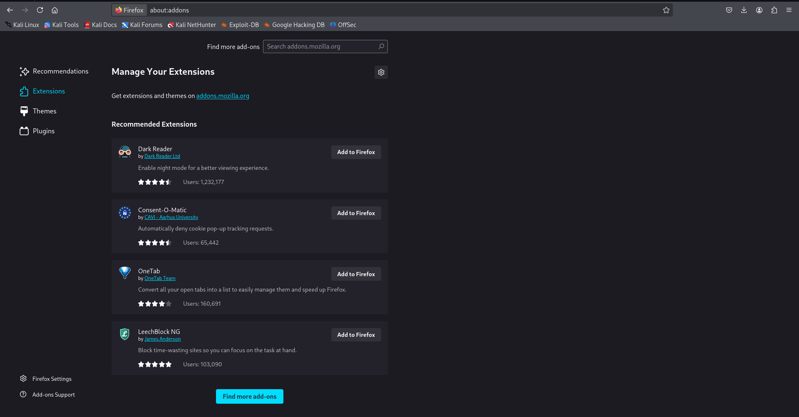

#  Task 7 – Browser Extension Security Check

##  Overview
The goal of this task was to review installed browser extensions, identify any potentially malicious ones, and remove them to improve browser security.  
In this case, **no extensions were installed**, indicating a clean browser environment.

---

##  Screenshot
### Extensions Page (No Extensions Installed) 

---

##  Steps Performed
1. **Opened the browser’s extensions manager**  
   - Chrome: `Menu (⋮) → More Tools → Extensions`  
   - Firefox: `Menu (≡) → Add-ons → Extensions`

2. **Reviewed installed extensions**  
   - Found **no extensions** in the browser.

3. **Verified Security Status**  
   - No potentially harmful or unused extensions present.
   - Browser in a secure, default state.

---

##  Research – How Malicious Extensions Harm Users
- **Data Theft** – Can steal credentials, personal data, and browsing history.  
- **Tracking & Profiling** – Track browsing habits and sell user data.  
- **Ad Injection** – Insert ads, banners, or redirects into websites.  
- **Malware Delivery** – Download and execute malicious code.  
- **Phishing Redirects** – Send users to fake login pages to capture credentials.

---

##  Security Best Practices for Browser Extensions
1. Install extensions only from **official stores** (Chrome Web Store, Firefox Add-ons).  
2. Check **reviews, ratings, and developer credibility** before installing.  
3. Avoid extensions that request **unnecessary permissions**.  
4. Regularly review installed extensions and remove unused ones.  
5. Keep your browser updated to prevent exploitation of vulnerabilities.

---

##  Conclusion
This browser was found to have **no installed extensions**, reducing the attack surface for malicious activities.  
Regularly reviewing and managing extensions is essential for maintaining browser security.

---

**🔹 Author:** Mohammad Farhan Hussain
**🔹 Internship:** Elevate Labs Cybersecurity Internship
**🔹 Tools:** Firefox Browser Add-ons (Extensions)
